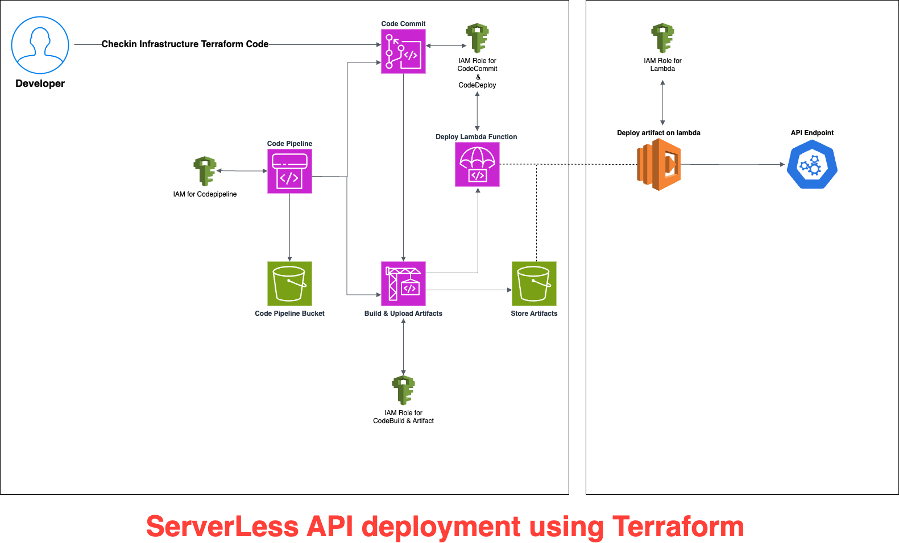

# Create an AWS Codepipeline with Terraform

This demo is intended to demonstrate how to create codepipelines on AWS using Terraform.

# Implementation

## HLD



We will be provisioning AWS Codepipeline and its supporting AWS Services like `AWS Codbuild` and `AWS CodeCommit` and `AWS S3` and finally using the provisioned codepipeline to provision lambda resource and deploy a sample lambda application `ref folder: serverless-fastapi-demo` into AWS.

## Pre-requisites

This code is split into two parts,

1. Infrastructure for Codepipeline Deployment. ie, code under the path ```provision-aws-infra/```
2. Uploading the Lambda code to CodeCommit Repository. ie, lambda code on path ```fastapi_devops_serverless_code_repo/```

To achieve this, follow the pre-requisites steps below

1. Install Terraform : [link](https://learn.hashicorp.com/tutorials/terraform/install-cli)
2. Install AWS CLI : [link](https://docs.aws.amazon.com/cli/latest/userguide/getting-started-install.html)
3. Configure AWS CLI with AWS Account do `aws sts get-caller-identity` for validation) : [link](https://docs.aws.amazon.com/cli/latest/userguide/cli-chap-configure.html)
4. Create a S3 Bucket in us-east-1. This bucket will be used to store the terraform state file. Note the bucket arn as it will be used in the steps below.

## Folder Structure for Infrastructure provision

```
Serverless-Fastapi-Demo/provision-aws-infra
├── README.md
├── img
│   ├── Codepipeline_Architechture.png
│   ├── Serverless_API_deployment.png
│   └── codepipeline-output.png
├── main.tf
├── modules
│   ├── codecommit
│   │   ├── main.tf
│   │   ├── outputs.tf
│   │   └── variables.tf
│   └── codepipeline
│       ├── main.tf
│       ├── outputs.tf
│       ├── roles.tf
│       ├── templates
│       │   ├── buildspec_build.yml
│       │   ├── buildspec_deploy.yml
│       │   └── buildspec_upload.yml
│       └── variables.tf
├── outputs.tf
├── providers.tf
├── terraform.tfvars
├── variables.tf
└── versions.tf
```
## Folder Structure for Infrastructure provision
```
Serverless-Fastapi-Demo/fastapi_devops_serverless_code_repo
├── README.md
├── Serverless API deployment.png
├── books.json
├── lambda_terraform
│   ├── main.tf
│   ├── outputs.tf
│   ├── providers.tf
│   ├── terraform.tfvars
│   ├── variables.tf
│   └── versions.tf
├── main.py
└── requirements.txt
```

## Provision Infrastructure

Deploying the Infrastructure:

1. Navigate to the directory `cd provision-aws-infra/` 
2. Open the file `terraform.tfvars` and change the ORG_NAME, TEAM_NAME and PROJECT_ID. Example file below,
```
org_name   = "cloudplatform"
team_name  = "team"
project_id = "deployment123"
region     = "us-east-1"
env = {
  "dev" = "dev"
  "qa"  = "qa"
}
codebuild_compute_type = "BUILD_GENERAL1_MEDIUM"
codebuild_image        = "aws/codebuild/amazonlinux2-x86_64-standard:3.0"
codebuild_type         = "LINUX_CONTAINER"
codecommit_branch      = "master"

```
3. Change the BUCKET_NAME in the file `provision-aws-infra/providers.tf` with the bucket you created in pre-requisites. Use the bucket name, not the ARN
4. Change the BUCKET_NAME in the file `provision-aws-infra/modules/codepipeline/roles.tf` with the bucket you created in pre-requisites. Use the Bucket ARN here.
5. Change the BUCKET_NAME in the file `fastapi_devops_serverless_code_repo/lambda_terraform/providers.tf` with the bucket you created in pre-requisites. Use the bucket name, not the ARN

You are all set. Let's run the code

1. Navigate to the directory `cd provision-aws-infra` 
2. Run `terraform init`
3. Run `terraform validate`
4. Run `terraform plan`  and review the output in `terminal`
5. Run `terraform apply` and review the output in `terminal` and when ready, type `yes` and hit enter
6. You should be seeing a output similar to this:

   ```
   Apply complete! Resources: 11 added, 0 changed, 0 destroyed.

   Outputs:

   codecommit = "https://git-codecommit.us-east-1.amazonaws.com/v1/repos/fastapi_devops_serverless_code_repo"

   codepipeline = "arn:aws:codepipeline:us-east-1:<account#>:fastapi_devops_codepipeline"

   ```

Great, we have completed provisioning the Infrastructure. Now let's push the Lambda code to codecommit which will trigger codepipeline to deploy the lambda code. 

1. Run `cd..` into the Root folder. From the output above, copy the code commit repository link. 
2. Run `git clone <codecommit repo link>`
3. If credentials are required, Generate a CodeCommit credentials from `aws console` for the IAM user that you logged in:
   1. Select `Users` from IAM (Access Management Tab)
   2. Select the user that you want to provide CodeCommit Access to.
   3. Select `Security Credentials` from the User information panel.
   4. Scroll down and you should be seeing a subsection `HTTPS Git credentials for AWS CodeCommit`
   5. Click on `Generate Credentials`, you should be prompted with Download credentails in cvs file.
4. Once git clone and git authentication is successful, cd to cloned directory. This directoy will be empty as we haven't pushed the code yet.
5. Copy Lambda application code from `fastapi_devops_serverless_code_repo` folder to git repo by running `cp -R fastapi_devops_serverless_code_repo/` . For simplicity, I am referring the cloned repo as codecommitrepo. 

After this ```cd codecommitrepo``` and do a ```ls```, the repo should look like below,

```
(master) $ ls
LICENSE
README.md
books.json
lambda_terraform
main.py
requirements.txt
```
6. Push the changes to git repo by running `git add. && git commit -m "Initial Commit" && git push`
7. Thats it!, you can now navigate to AWS Codepipeline from `aws console` and check the pipeline status.
8. If everything goes well, you should be seeing an output simillar to this:   

Reference links:

1. AWS Codepipeline : <https://registry.terraform.io/providers/hashicorp/aws/latest/docs/resources/codepipeline>
2. AWS CodeBuild: <https://registry.terraform.io/providers/hashicorp/aws/latest/docs/resources/codebuild_project>
3. AWS CodeCommit: <https://registry.terraform.io/providers/hashicorp/aws/latest/docs/resources/codecommit_repository>
4. AWS ECR: <https://registry.terraform.io/providers/hashicorp/aws/latest/docs/resources/ecr_repository>
5. Terraform Output Values: <https://www.terraform.io/language/values/outputs>


## License

This library is licensed under the MIT-0 License. See the LICENSE file.